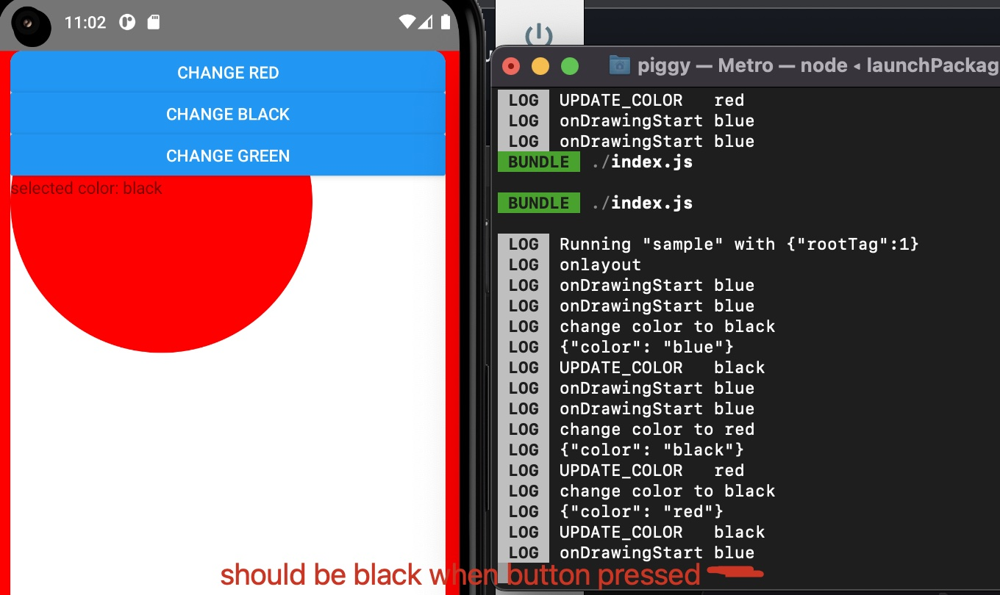

# Sample app for debugging an issue seen when using react native skia

Original question: https://github.com/Shopify/react-native-skia/issues/656

## Installation

npm install
npx react-native start
npx react-native run-android

## To repro

color is the redux state, and it could be updated as expected. 
click on the buttons do update the text to corresponding color.

However, if press anywhere in the middle of the screen (the canvas), the onTouchHandler callback still outputs the same default color.